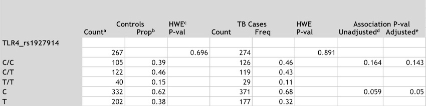
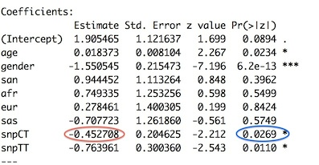
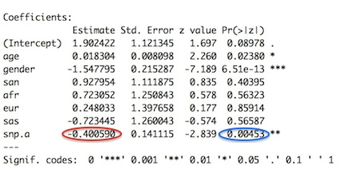
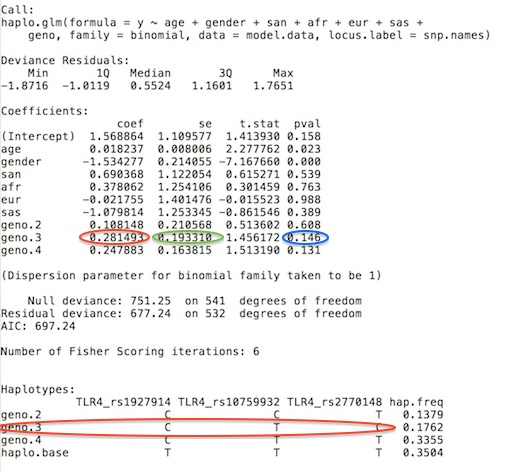

# TB host genetics case control analysis R scripts 

This repository hosts a set of R scripts that was developed for the TB host 
genetics group in the Molecular Biology and Human Genetics Department of the 
Faculty of Medicine and Health Sciences at Stellenbosch University, to analyze 
SNP genetic variants genotyped in their case-control studies in a systematic 
manner. 
The study cohort used by the TB host genetics group is the admixed group known 
as the South African Coloured population. 
The analyses adjusts for age, gender and ancestry, as these factors differ 
between cases and controls. 
Different covariates may be applicable in other study cohorts, and the scripts 
would therefore most likely require modification when used in other contexts.

The scripts assume R version 3.1.0 or later, and assumes that the R genetics 
and haplostats packages have been installed (versions of these packages that 
the scripts have been tested on is 1.3.8.1 and 1.6.8 respectively).

## Directory and file structure

The scripts assume the following directory structure:

* data
	* analysis
	* input
	* output
	* raw
* scripts

The R scripts in this repository lives in the _scripts_ directory.

The raw folder should contain two **tab delimitted** text files, SNPs.txt and 
sample_info.txt.
SNPs.txt has the SampleID as first column, followed by SNP names, with each 
genotyped sample's data contained in 1 row. 
For example:

> SampleID	TLR4_rs1927914	TLR4_rs10759932	TLR4_rs2770148  
> 2	CC	TT	CT  
> 16	CC	TT	CC  
> 17	TT	TT	TT  
> 19	CT	CT	TT  

sample_info.txt should contain the CaseID, SampleID, age, gender and ancestry 
proportions of the study cohort, 1 row per sample, e.g.:

> CaseID	SampleID	Class	Age	Gender	SanAncestry	AfricanAncestry	EuropeanAncestry	SouthAsianAncestry	EastAsianAncestry  
> 1	37	1	9.583561644	1	0.31687	0.256597	0.12955	0.114696	0.182278  
> 3	648	1	3.967123288	2	1e-05	0.49113	0.250413	0.094221	0.164226  
> 7	649	1	6.090410959	2	0.565349	0.039008	0.183765	0.170561	0.041317  

Controls have a Class of 0, whereas cases have a Class of 1. Males have a Gender of 1 and Females have a Gender of 2.

Note: With the exception of the SNP names, the exact case, spelling and ordering 
of the columns are important, as the scripts assume these column names and 
ordering. 

## Executing the scripts

Scripts should be executed in the order that they are numbered.

### Step 1: Create a tidy input file

**Execute 1_explore_and_clean_data.R.**

This script reads the SNPs.txt and sample_info.txt file in the data/raw 
directory. 
Careful attention should be paid to the comments in the script as the steps are 
executed: a number of checks is suggested, to ensure that the SNP data is correct 
(e.g. correct coding of missing genotypes, and checking if duplicate individuals 
are included in the analysis). 
Cleaning steps that may be required will differ from study to study, and this 
script may therefore need to be updated with the steps that was taken to correct 
the data.
The SNPs.txt and sample_info.txt files are merged after the checks were performed 
and issues were fixed.
Samples with missing covariates are removed, and a "clean" input file is written 
(to data/input/TB_assoc.txt)

### Step 2: Summarize the study cohort data

**Execute 2_summarize_sample_characteristics.R**

This script summarizes the age, gender and ancestry proportions of the study 
cohort graphically in two PDF output files: data/output/sample_gender_age.pdf
and data/output/sample_ancestry.pdf.
These covariates are also summarized in a table, as 
data/output/sample_info_summary.txt.
The text in this file can be pasted into an excel spreadsheet (e.g. in the 
analysis folder) and then formatted into a nice looking table. 

### Step 3: Summarize the genetic variants

**Execute 3_summarize_snps.R**

This script produces text that can be pasted into an excel spreadsheet (e.g. 
in the analysis folder), to create a nice looking table that summarizes the 
distribution of genetic variants between cases and controls 
(data/output/snp_summary.txt).
P-values are included, and can be used to decide whether the relationship
between genetic variants and disease outcome should be further explored. 
More on how to decide this, under the section "Interpreting results" below.
If so, then move on to step 4. 

### Step 4: Fit statistical models to the data

**Execute 4_analyze_snps.R**

This script can be used to fit statistical models in order to test for 
association between SNP variants identified in step 3 and case/control 
status, and to estimate odds ratios and confidence intervals. 
Pay careful attention to the TODO comments in the script, as the analysis 
will vary from study to study.

### Step 5: Hayplotype analysis

**Execute 5_haplotype_analysis.R**

This script can be used to do haplotype analysis of a list of ordered SNPs
that form a haplotype. 
Careful attention should be paid to the TODO comments in the script.

Before executing the script, haplotypes and the SNPs that form them 
should be identified.
The script recommends the use of the software program HaploView to do this.
When analyzing a small gene/few SNPs that are in very tight LD, e.g. 
only 3 SNPs that are in LD with r2 > 0.975, it might not make
sense to do haplotype analysis - this will give you no extra information
than what you would have found in the single SNP analysis. 
Rather than using HaploView, one could also analyze all possible 
windows of SNPs, e.g. for a 5 SNP gene, analyse all 5 SNPs, then analyze
the two possible 4 SNP haplotypes, then analyze the three possible 3 SNP
haplotypes, then analyze the four possible 2 SNP haplotypes. 
Even if the SNPs do not form "real" haplotype blocks, there might be 
SNPs that are "interacting" with one another within a gene.

The script writes it output to data/output/haplo_summary.txt.
At the top of the file is text that can be pasted into an excel 
spreadsheet to summarize the estimated haplotype frequencies in cases and 
controls.
(If there are any NA frequencies, simply change these to 0.)
At the bottom of the file the adjusted and unadjusted p-values of 
whether the variance in the haplotypes explains disease outcome, is printed.
If the adjusted p-value is significant (< 0.05), one should use the 
model output to estimate odds ratios and their confidence intervals 
for the individual haplotypes that modifies disease outcome, as well
as the p-values for the association between the individual haplotypes
and disease outcome. 

### Optinal interaction analysis

Two scripts, run_interactions.R and plot_interactions.R can be used to 
fit 2 SNP gene-gene interaction models, if you have two or more genes
in your data set. 
Pay careful attention to the TODO comments in the scripts.

First run *run_interactions.R*. 
In the data/output directory, models with p-values < 0.05 for the 
snp-snp interaction term are summarized. 
This includes a q-value, which is analogous to a p-value, and has been 
derived in an attempt to control the false discovery rate at an alpha
level of 0.05 (refer to http://onlinelibrary.wiley.com/doi/10.1111/1467-9868.00346/full). 
This might be over conservative.
I would suggest that one determines the number of gene pair models 
that were fitted (nr of genes choose 2, e.g. 5 genes choose 2 = 10 
gene-gene models, you can use the *choose()* function in R to 
calculate this, e.g. *choose(5,2)*) and then to use a Bonferroni
correction using this as number of tests. 

If there are any interesting models, explore this using the 
*plot_interactions.R* script.
Three plots will be created in the data/output directory. 

See my gene-gene interactions paper for information on the 
statistical methods used, and how results should be interpreted. 

## Interpreting results

### SNP summary

The following example table entry illustrates how the table data should
be read.

* 267 controls and 274 cases were genotyped for the TLR4_rs1927914 SNP.
* A test for HWE has a p-value of 0.696 in controls and 0.891 in cases.
* The CC genotype was found in 105 (39% of) controls, and in 126 (46% of) cases
* The C allele was found 332 times in controls (105 + 105 + 122)
* When fitting a genotypic logistic regression model, the p-value for the amount of variance that is explained when including vs not including the SNP in the model is 0.164 for a model that does not adjust for covariates (age, gender and ancestry), and 0.143 for a model that does adjust for covariates
* When fitting an additive allelic logistic regression model, the p-value for the amount of variance that is explained when including vs not including the SNP in the model is 0.059 for a model that does not adjust for covariates (age, gender and ancestry), and 0.05 for a model that does adjust for covariates

**Important notes**

* When the analysis is reported, one would typically NOT include the 
HWE p-value in cases, and also NOT include the unadjusted p-values. 
* If the HWE p-value < 0.05 in controls, a genotyping error has occurred, 
and one would not analyse the SNP further.
* A HWE p-value of -999 means that a p-value could not be calculated, because the minor allele was too rare.  Since very large sample sizes are required to detect associations between very rare variants and disease outcome, it does not make sense to analyze such SNPs further. 
* Barring the above, if either the genotypic or additive allelic P-values are < 0.05, one would continue to analyze the SNP and estimate odds ratios for the variants.  

### Logistic regression models

#### Why logistic regression?

We use logistic regression models to measure the association between 
a SNP and disease outcome for the following reasons:

1. The outcome is binary (only 2 outcomes, either case or control) - therefore we use *logistic* regression
1. Age, gender and ancestry differ between cases and controls - by using *regression*, we can adjust for these factors (if we did not have to adjust forthese factors, we could have simply used a chi-square test) 
1. We can measure the effect that a variant has on disease outcome by estimating odds ratios

#### Types of SNP genetic models

* Genotypic model
* Allelic model
	* Additive - having 1 copy of the rare variant changes disease odds, and having 2 copies of the rare variant doubles this change in disease odds
	* Dominant - having 1 or 2 copies of the rare variant changes the disease odds by a certain amount
	* Recessive - having 2 copies of the rare variant changes the disease odds by a certain amount (having 1 copy of the rare variant is the same as having no copies of the rare variant)

In a genotypic model, the proportion of genotypes are compared between cases
and controls, versus the most common genotype. 
For example, if a SNP has three genotypes AA, AT and TT, and AA is the 
wildtype homozygote, the odds of having disease is modelled for the AT 
genotype compared to the AA genotype, and for the TT genotype compared to 
the AA genotype.

In allelic models, we give a numeric meaning to how many copies of the rare 
variant an individual has, and how that effects the odds of having disease.
We no longer model the odds of having disease compared to a reference genotype, 
rather we model how the number of copies of the rare variant an individual has, 
changes the odds of having disease.

In summary, for a genotypic model, we compare the actual categories of genotypes
between cases and controls.
For the allelic models, we attempt to be a little bit more sophisticated, and try to
model the effect of the number of copies of the rare variant.
The genotypic model is more parsimonious, and is therefore preferred in my opinion;
the allelic models may be a little bit artificial - one rarely has variants that fit 
the categories or additive, dominant or recessive exactly.

#### How the odds ratio is determined from the model coefficients

The following equation is fitted to the data with logistic regression modelling:

log(odds) = a0 + a1x1 + a2x2 + ... + amxm 

where  ai is the coefficients in the model, and  xi is 
the factors/variables in disease outcome, i = 0,...,m.

am is the amount that the xm variable changes the log odds of having disease.

eam is therefore the amount that the  xm variable changes the odds of having disease (we  are not interested in the log odds of disease, but the odds of disease, therefore we need to exponentiate the coefficient)

#### Where to get the model coefficients and p-values

The coefficient that shoud be used to calculate the CT genotype odds ratio is 
circled in red below. 
The association p-value for the CT genotype is circled in blue.

The coefficient that should be used to calculate the additive allelic odds ratio
is circled in red below.
The association p-value is circled in blue.

The coefficient that should be used to calculate the odds ratio for the geno.3
haplotype (C/T/C) is circled in red below.
The standared error that should be used to calculate the confidence interval 
is circled in green.
The association p-value for geno.3 is circled in blue.

#### How should the odds ratio be interpreted

Odds ratio = probability of having disease / probability of not having disease 
(where probability of not having disease = 1 - probability of having disease).

* Odds ratio of 1: equal probability of having disease (0.5) - nothing is going 1
* Odds ratio > 1: probability of having disease is higher than not having disease (increased susceptibility)
* Odds ratio < 1: probability of having disease is lower than not having disease (protective)

**Odds ratio for a genotype in a genotypic model.**
Compared to the most common genotype, the odds of having disease for a carrier of 
the genotype is *estimated odds ratio*.
Note: an odds ratio for the most common/reference genotype does not exist.

**Odds ratio for the rare variant in an allelic model.**
For an additive allelic model, each copy of the rare variant multiplies the odds of 
having disease with *estimated odds ratio*.
For a dominant allelic model, having either 1 or 2 copies of the rare variant 
multiplies the odds of having disease with *estimated odds ratio*.
For a recessive allelic model, having 2 copies of the rare variant multiplies
the odds of having disease with *estimated odds ratio*.

**Odds ratio for a haplotype.**
Compared to an individual carrying two of the most common haplotypes, each 
copy of the haplotype multiplies the odds of having disease with  
*estimated odds ratio*.

#### What the p-values mean

What is the probability of the observing such data, if the null hypothesis is true.

**P-values from model output.**
The null hypothesis is that the odds ratio in question is 1.
If the p-value is < 0.05, we reject the null hypothesis, and say that the odds ratio 
is indeed different from 1. 
The smaller the p-value is, the more confidence we have about this statement.

**P-values from SNP summary.**
The SNP summary p-values that are reported alongside the genotypes comes from an 
ANOVA - which answers the question whether the variance in the genotype distribution
explains the disease outcome (the null hypothesis is that the variance in the genotypic
distribution does not explain the disease outcome). 
One gets a single p-value for the entire SNP, and not individual p-values for each 
different genotype.
If this single p-value is small, it means that there are differences in the genotypic
distribution between cases and controls, and it makes sense to fit a model so one 
can get odds ratios and p-values for the individual genotypes. 
If the p-value is large, the genotypic distribution does not differ between cases and
controls, and it does not make sense to investigate the SNP further.
The p-values that are reported alongside the alleles are the additive allelic p-value, 
and also comes from an ANOVA.
This p-value should be of the same order that you get from the logistic regression 
model for the SNP, but may be slightly different, because it uses a different 
mathematical technique to calculate it. 
The ANOVA p-value is slightly more robust than the p-value that you get from the 
logistic regression model. 
Only the additive allelic p-value is reported with the SNP summary, since this 
is the most intuitive allelic model.
If this p-value is fairly small, it makes sense to also calculate the recessive 
and dominant p-values in step 4, as these models could potentially fit the data 
better.

**P-values from the haplotype analysis.**
An overall p-value for the association between the haplotype and disease 
outcome is reported.
This p-value has been calculated based on 20 000 permutations. 
P-values for the association between individual haplotypes and disease outcome 
is reported as part of the model output.

#### What the confidence intervals mean

The confidence interval of an odds ratio is related to the p-value of the 
genotype/variant.
If the p-value < 0.05, the 95% confidence interval should not include the value 
1.

We have an estimated odds ratio (which was estimated from a sample from the 
population). 
We are however really interested in knowing what the true population odds ratio
is.
If the true population odds ratio does not lie in the confidence interval, then an 
event has occurred per chance with a probability of 5% or less.
Another way of saying this is that there is a 95% probability that the confidence
interval contains the true odds ratio.
A **wrong** statement is that there is 95% probability that the true odds ratio
is in the confidence interval (the true odds ratio is not a random variable - we 
cannot make probability statements regarding it, whereas we can make probability
statements regarding the confidence interval).

#### Why are the overall p-values in the SNP summary sometimes inconsistent with individual p-values

The initial summary p-value is given by *anova()*. 
This compares the amount of unexplained variance in the data before the 
genotype is added to the model, to the amount of unexplained variance in the 
data after the genotype has been added to the model. 
A statistical distribution is then used to determine if the amount that the 
variance has been reduced by by adding the genotype to the model, is 
statistically significant. 
In this way we get a single "overall" p-value for the SNP (a large reduction 
in variance would be statistically significant and give a small p-value, 
whereas a small reduction in variance would not be statistically significant 
and yield a bigger p-value).
Now in the fourth step, we want to know which genotypes, compared to the 
reference genotype, are found more or less frequently in the "case" category, 
and use the glm() command for this. 
We get a p-value and an effect estimate (that gets converted to an OR) for each 
genotype, compared to the reference genotype, and no longer get a single 
overall genotype p-value. 
The frequency distributions and techniques to get a p-value is different 
between the *anova()* and *glm()* methods. 
In most cases, if the *anova()* p-value indicates that the unexplained 
variance in the data is reduced when adding the genotype to the model, 
the individual p-values given by *glm()* is also significant. 
But this is not always the case - when compared to the "base" category, the 
difference in genotype frequency between cases and controls may not be large 
enough to yield a significant result. 
One can try and use a difference reference genotyoe, using the 
*relevel()* command in R, to try and remedy this situation.

## Reporting results

* Report the adjusted p-values, do not report the unadjusted p-values (they were included in the analysis so that one can eyeball the results and check if everything looks consistent)
* Be consistent in your use of decimal places. I use 2 decimal places for odds ratios, and 4 for p-values (and use < 0.0001 for very small p-values).
* Use the word proportion for observed proportions of genotypes and rare variants (it is a statistic that has been calculated directly from the data)
* Use the word frequency for haplotype frequencies (we have estimated the population haplotype frequencies from the data)
